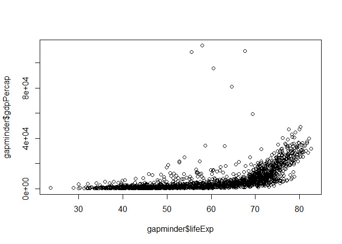

Home work 1 with Gap minder data
================================

Exploring the Gapminder data
----------------------------

    str(gapminder)

    ## Classes 'tbl_df', 'tbl' and 'data.frame':    1704 obs. of  6 variables:
    ##  $ country  : Factor w/ 142 levels "Afghanistan",..: 1 1 1 1 1 1 1 1 1 1 ...
    ##  $ continent: Factor w/ 5 levels "Africa","Americas",..: 3 3 3 3 3 3 3 3 3 3 ...
    ##  $ year     : int  1952 1957 1962 1967 1972 1977 1982 1987 1992 1997 ...
    ##  $ lifeExp  : num  28.8 30.3 32 34 36.1 ...
    ##  $ pop      : int  8425333 9240934 10267083 11537966 13079460 14880372 12881816 13867957 16317921 22227415 ...
    ##  $ gdpPercap: num  779 821 853 836 740 ...

Checking for Missing Values
---------------------------

    anyNA(gapminder)

    ## [1] FALSE

Checking the mean GDP per capita
--------------------------------

    mean(gapminder$gdpPercap)

    ## [1] 7215.327

Looking at the relation between GDP per capita vs Life Expectancy
-----------------------------------------------------------------

    plot(gapminder$lifeExp,gapminder$gdpPercap)

Looking at the relation between GDP per capita vs life expectancy statistically, the correlation value is:
----------------------------------------------------------------------------------------------------------

    cor(gapminder$lifeExp,gapminder$gdpPercap, method=c("pearson","kendall","spearman"))

    ## [1] 0.5837062
